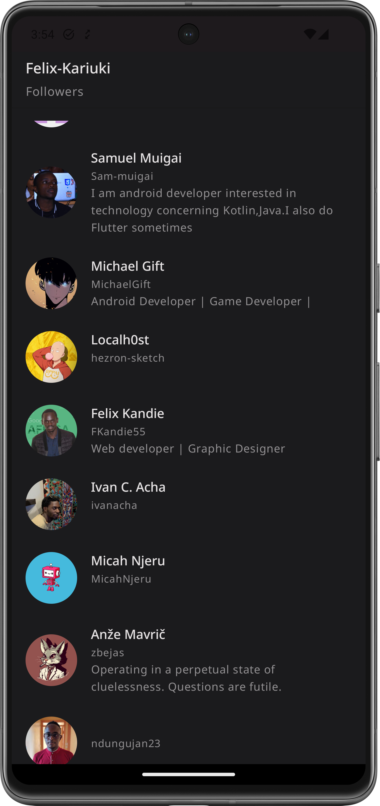

# Github GraphQl
This is a github android application clone that uses the github [GraphQl](https://graphql.org/) api using the [Apollo Kotlin](https://www.apollographql.com/docs/kotlin/) Graph Ql client

[GraphQl](https://graphql.org/) -> GraphQL is a query language for APIs and a runtime for fulfilling those queries with your existing data. 
GraphQL provides a complete and understandable description of the data in your API, gives clients the power to ask for exactly what they need and 
nothing more, makes it easier to evolve APIs over time, and enables powerful developer tools.


## Use
In the NetworkModule replace the Token with your github token
``` kotlin

 private const val BASE_URL = "https://api.github.com/graphql"
 private const val token = "GITHUB_TOKEN_HERE"

```

## Project setup
The Github Qraph Ql schema file and the Queries are already set up. you can find them here:
```
data/src/main/graphql/com/flexcode
```

You can create the ``schema.graphqls`` your self by using the gradlew task command as shown.
Run it on you terminal. Replace the token with your own token.

``` gradle

 ./gradlew :app:downloadApolloSchema --endpoint='https://api.github.com/graphql' --schema=app/data/src/main/graphql/com/flexcode/schema.graphqls --header="Authorization: Bearer GITHUB_TOKEN_HERE"

```

## Resources
[GithubGraphQl](https://docs.github.com/en/graphql) Api

[Apollo Kotlin](https://www.apollographql.com/docs/kotlin/)

[GraphQl](https://graphql.org/)


[GraphQl Plugin](https://plugins.jetbrains.com/plugin/20645-apollo-graphql)

[GraphQl Explorer](https://studio.apollographql.com/public/github/variant/current/explorer)

## **Screenshots 📷**
| | | |
|:-------------------------:|:-------------------------:|:-------------------------:|
| |  |  |
|  | 


## **Tech stack & Libraries 🛠️👨‍💻**
- [Apollo kotlin](https://www.apollographql.com/docs/kotlin/) - A strongly-typed, caching GraphQL client for Java and Kotlin multiplatform and is a GraphQL client that generates Kotlin and Java models from GraphQL queries.
 - [Kotlin](https://kotlinlang.org/docs/reference/) - Kotlin is a cross-platform, statically typed, general-purpose programming language with type inference. Kotlin is designed to interoperate fully with Java, and the JVM version of Kotlin's standard library depends on the Java Class Library, but type inference allows its syntax to be more concise
 * [Jetpack Components:](https://developer.android.com/topic/architecture?gclid=Cj0KCQjw8O-VBhCpARIsACMvVLOH1satX45o9f4PMQ4Sxr7bG9myl6-KZL9nYda8PJsHV7m2uJL8bzgaAmqiEALw_wcB&gclsrc=aw.ds)
    * [Jetpack Compose](https://developer.android.com/jetpack/compose?gclid=Cj0KCQjwhqaVBhCxARIsAHK1tiMMwHsxQ8Z25jyEdtLha9erq11wROoEfL6RqpGMprgbDTNuMO3_Ri8aAu5EEALw_wcB&gclsrc=aw.ds) -  Android’s modern toolkit for building native UI. It simplifies and accelerates UI development on Android
    * [View Model](https://developer.android.com/topic/libraries/architecture/viewmodel)-  store and manage UI-related data in a lifecycle conscious way.
    * [Lifecycle]( https://developer.android.com/topic/libraries/architecture/lifecycle) - Perform actions in response to a change in the lifecycle status of another component, such as activities and fragments.
    * [LiveData](https://developer.android.com/topic/libraries/architecture/livedata.html) - A lifecycle-aware data holder with the observer pattern
    * [Android KTX](https://developer.android.com/kotlin/ktx.html) - Android KTX is a set of Kotlin extensions that are included with Android Jetpack and other Android libraries. KTX extensions provide concise, idiomatic Kotlin to Jetpack, Android platform, and other APIs.
    * [AndroidX](https://developer.android.com/jetpack/androidx) - Major improvement to the original Android [Support Library](https://developer.android.com/topic/libraries/support-library/index), which is no longer maintained.


* [Dagger-Hilt](https://dagger.dev/hilt/)- a dependency injection library for Android that reduces the boilerplate of doing manual dependency injection in your project

* [Coroutines](https://developer.android.com/kotlin/coroutines) - a concurrency design pattern that you can use on Android to simplify code that executes asynchronously
* [Flow](https://developer.android.com/kotlin/flow)- In coroutines, a flow is a type that can emit multiple values sequentially, as opposed to suspend functions that return only a single value.

* [CI/CD](https://codemagic.io/android-continuous-integration/) - Continuous integration systems let you automatically build and test your app every time you check in updates to your source control system. 

* [Coil](https://coil-kt.github.io/coil/compose/) - Image Loader library.

 * [Compose Navigation]()
 * [Lottie Animation](https://lottiefiles.com/what-is-lottie) - A Lottie is a JSON-based animation file format that allows you to ship animations on any platform as easily as shipping static assets. 
 
 ## Testing
  

 ## Architecture

 ## Author
Felix Kariuki

<a href="https://www.buymeacoffee.com/felix.kariuki" target="_blank"></a>

Do Reach Out :

  * [Twitter](https://twitter.com/felixkariuki_)

  * [LinkedIn](https://www.linkedin.com/in/felix-kariuki/)
  
   ## License and Copyright

[MIT LICENSE](LICENSE)
  
  ```
  MIT License

Copyright (c) 2024 Felix m Kariuki

Permission is hereby granted, free of charge, to any person obtaining a copy
of this software and associated documentation files (the "Software"), to deal
in the Software without restriction, including without limitation the rights
to use, copy, modify, merge, publish, distribute, sublicense, and/or sell
copies of the Software, and to permit persons to whom the Software is
furnished to do so, subject to the following conditions:

The above copyright notice and this permission notice shall be included in all
copies or substantial portions of the Software.

THE SOFTWARE IS PROVIDED "AS IS", WITHOUT WARRANTY OF ANY KIND, EXPRESS OR
IMPLIED, INCLUDING BUT NOT LIMITED TO THE WARRANTIES OF MERCHANTABILITY,
FITNESS FOR A PARTICULAR PURPOSE AND NONINFRINGEMENT. IN NO EVENT SHALL THE
AUTHORS OR COPYRIGHT HOLDERS BE LIABLE FOR ANY CLAIM, DAMAGES OR OTHER
LIABILITY, WHETHER IN AN ACTION OF CONTRACT, TORT OR OTHERWISE, ARISING FROM,
OUT OF OR IN CONNECTION WITH THE SOFTWARE OR THE USE OR OTHER DEALINGS IN THE
SOFTWARE.
  
  ```
